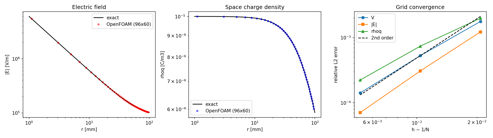
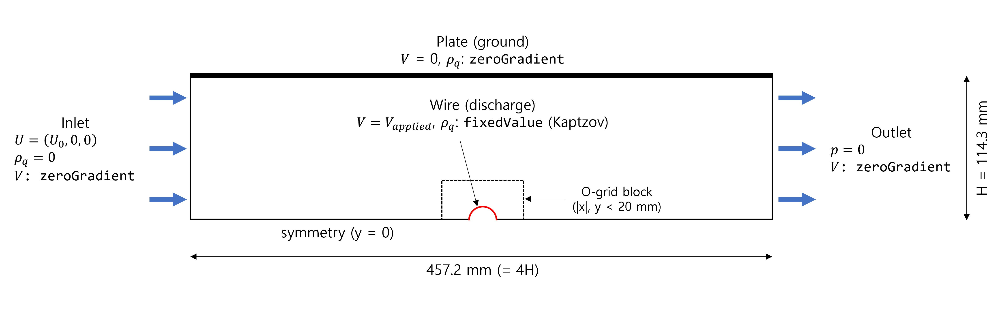
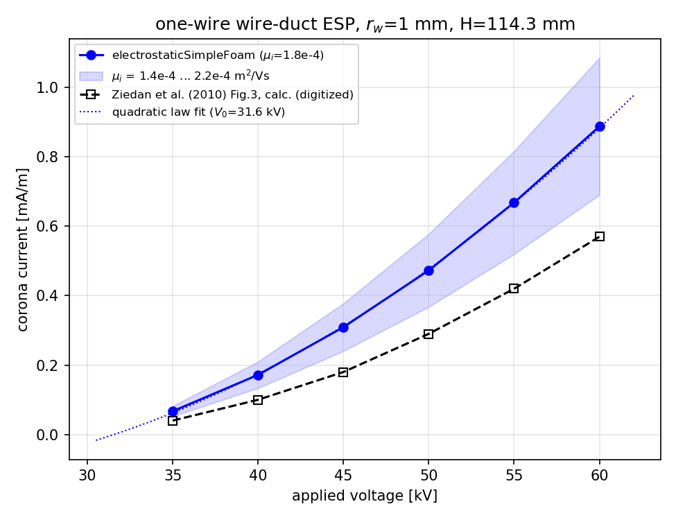
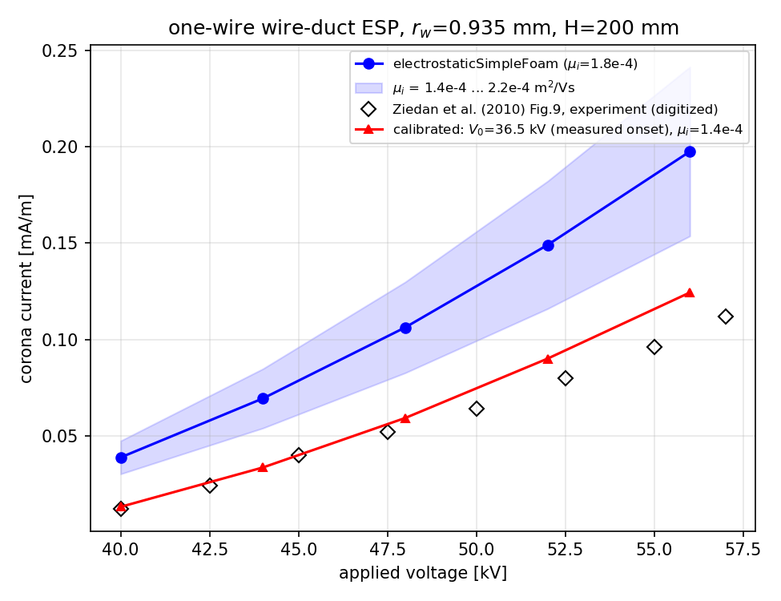
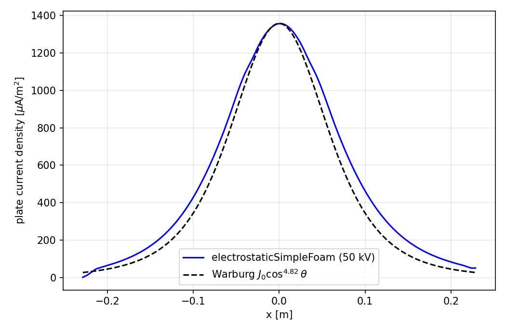
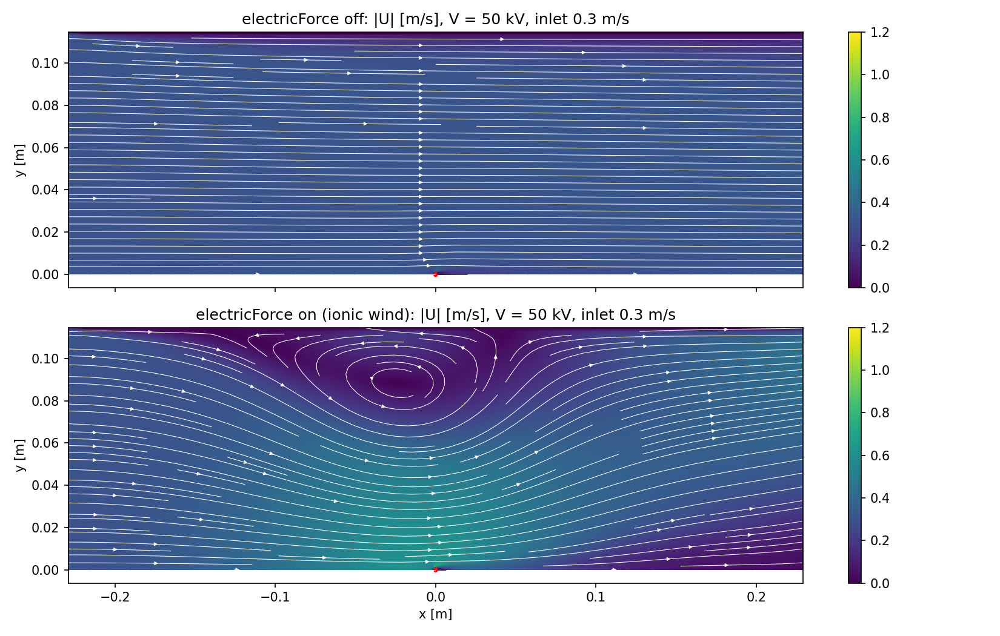
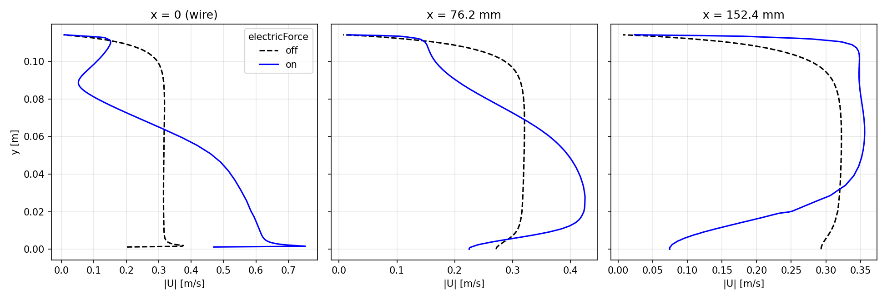

# 예제 18. 사용자 정의 솔버 만들기 : 전기수력학 솔버 electrostaticSimpleFoam

- 이 예제는 OpenFOAM 튜토리얼(한국어판)에 새로 추가된 내용으로, [CC BY-NC-SA 3.0](https://creativecommons.org/licenses/by-nc-sa/3.0/) 라이선스 하에 배포된다.
- 이 자료는 ESI Group, ESI-OpenCFD 또는 OpenFOAM Foundation에 의해 승인된 자료가 아니다.

**호환성**:

- 이 예제에 수록된 명령어 및 소스 코드는 OpenFOAM v2412를 기반으로 작성되었다.

**선행 학습**:

- [예제 6. 난류 - 정상 상태](06_난류-정상-상태.md) : `simpleFoam`을 이용한 정상 상태 유동 해석
- [예제 15. 직류 코로나 방전](15_직류-코로나-방전.md) : `electrostaticFoam`을 이용한 코로나 방전 해석, Kaptzov 가설, Peek 방정식

---

## 목차

1. 배경
   - 1.1 이온풍
   - 1.2 지배 방정식
   - 1.3 솔버 설계 : `simpleFoam` + `electrostaticFoam`
2. OpenFOAM 솔버의 구조
   - 2.1 솔버 소스 코드의 위치
   - 2.2 솔버 소스 코드의 구성
   - 2.3 wmake 빌드 시스템
3. `electrostaticSimpleFoam` 만들기
   - 3.1 소스 복사 및 이름 바꾸기
   - 3.2 Make/files, Make/options 수정
   - 3.3 수정 전 빌드 확인
   - 3.4 변수 이름 충돌 검토
   - 3.5 createFields.H : 필드 및 물성 추가
   - 3.6 VEqn.H : 전위 방정식
   - 3.7 rhoqEqn.H : 전하 수송 방정식
   - 3.8 UEqn.H : 전기력 운동량 생성항
   - 3.9 메인 소스 파일 수정
   - 3.10 컴파일
4. 솔버 검증
5. 예제 : 와이어-평판 전기집진기의 이온풍 해석
   - 5.1 전처리
   - 5.2 격자 생성 및 해석 실행
   - 5.3 Kaptzov 반복
   - 5.4 전압 스윕과 전류-전압 곡선
   - 5.5 이온풍 효과 분석
   - 5.6 후처리 (ParaView)
6. 마무리
7. 참고 문헌

## 1. 배경

### 1.1 이온풍

[예제 15](15_직류-코로나-방전.md)에서 살펴본 것과 같이, 코로나 방전이 개시되면 방전극 주변에서 생성된 단극성 이온이 전기장을 따라 접지극으로 이동(drift)한다. 이온은 이동 중에 중성 기체 분자와 끊임없이 충돌하며, 이 충돌을 통해 이온이 전기장으로부터 받은 운동량이 중성 기체로 전달된다. 그 결과 방전극에서 접지극 방향으로 기체의 흐름이 유도되는데, 이를 **이온풍**(ionic wind), **전기풍**(electric wind), 또는 **코로나 바람**(corona wind)이라 한다. 보다 일반적으로, 전기력에 의해 유체의 운동이 유도되거나 변형되는 현상을 다루는 분야를 **전기유체역학**(electrohydrodynamics, EHD)이라 한다.

이온풍은 전기집진기(electrostatic precipitator, ESP) 내부의 유동 및 입자 포집 효율에 영향을 주는 2차 유동(secondary flow)으로 잘 알려져 있으며, 그 외에도 팬 없는 송풍기, 전자 장비 냉각, 경계층 제어용 플라즈마 액추에이터 등 다양한 응용 분야에서 연구되고 있다.

이온풍을 해석하려면 두 가지 물리 현상을 **연성**(coupling)하여 풀어야 한다.

- **정전기 문제** : 전위 및 전기장 분포(가우스 법칙), 공간 전하 분포(전하 수송 방정식) → 예제 15의 `electrostaticFoam`
- **유동 문제** : 비압축성 정상 상태 난류 유동(SIMPLE 알고리즘) → 예제 6의 `simpleFoam`

두 문제는 다음과 같이 서로 영향을 주고받는다.

- 정전기 → 유동 : 공간 전하 밀도 $\rho_q$와 전기장 $\vec{E}$가 만드는 **쿨롱 체적력**(Coulomb body force) $\vec{f}_E = \rho_q \vec{E}$ ($\mathrm{N/m^3}$)가 운동량 방정식의 생성항으로 작용한다.
- 유동 → 정전기 : 이온은 전기장에 의한 이동(drift)뿐 아니라 기체 유동에 의한 대류(convection)로도 수송되므로, 전하 수송 방정식에 유속 $\vec{U}$가 포함된다.

> **Note:** 이온의 전형적인 이동 속도는 $k|\vec{E}| \sim 10^{-4} \times 10^6 = 100$ m/s 수준으로, 일반적인 전기집진기 내부 유속(약 1 m/s)보다 훨씬 빠르다. 따라서 유동이 전하 분포(및 코로나 전류)에 미치는 영향은 작지만, 반대로 전기력이 유동에 미치는 영향은 클 수 있다. 이러한 연성의 비대칭성은 5.5절에서 해석 결과로 확인한다.

OpenFOAM은 이 두 물리를 동시에 푸는 솔버를 기본으로 제공하지 않는다. 이 예제에서는 `simpleFoam`과 electrostaticFoam을 결합하여 새로운 솔버 `electrostaticSimpleFoam`을 직접 만들면서, **OpenFOAM 솔버를 수정·확장하는 일반적인 절차**를 학습한다.

### 1.2 지배 방정식

새로운 솔버가 풀어야 할 방정식은 총 4개다. 정전기 변수 2개(전위 $V$, 공간 전하 밀도 $\rho_q$)와 유동 변수 2개(유속 $\vec{U}$, 압력 $p$)를 계산한다.

- 전위에 대한 푸아송 방정식 (가우스 법칙)

$$\nabla^2 V = -\frac{\rho_q}{\varepsilon_0}, \qquad \vec{E} = -\nabla V$$

- 정상 상태 전하 수송 방정식 (이동 + 대류 + 확산)

$$\nabla \cdot \left[ \rho_q \left( \vec{U} + k\vec{E} \right) \right] - \nabla \cdot \left( D_q \nabla \rho_q \right) = 0$$

- 비압축성 정상 상태 연속 방정식과 운동량 방정식 (전기 체적력 추가)

$$\nabla \cdot \vec{U} = 0$$

$$\nabla \cdot \left( \vec{U}\vec{U} \right) - \nabla \cdot \vec{R} = -\nabla p + \frac{\rho_q \vec{E}}{\rho}$$

여기서 $k$는 이온의 전기적 이동도($\mathrm{m^2/(V \cdot s)}$), $D_q$는 이온의 확산 계수($\mathrm{m^2/s}$), $\rho$는 기체의 질량 밀도($\mathrm{kg/m^3}$)이다.

> **Note:** 운동량 방정식의 전기력 항이 $\rho_q \vec{E}$가 아니라 $\rho_q \vec{E} / \rho$인 이유에 주의한다. `simpleFoam`은 비압축성 솔버로, 운동량 방정식 전체를 기체 밀도 $\rho$로 나눈 형태를 풀며, 압력 변수도 밀도로 나눈 운동학적 압력(kinematic pressure, $p/\rho$, 단위 $\mathrm{m^2/s^2}$)을 사용한다. 따라서 단위 부피당 힘($\mathrm{N/m^3}$)인 쿨롱 체적력도 반드시 $\rho$로 나누어 단위 질량당 힘($\mathrm{m/s^2}$)으로 입력해야 한다. 이를 빠뜨리면 차원 오류로 솔버가 즉시 멈추기 때문에 다행히 실수를 알아챌 수 있다. OpenFOAM의 차원 검사 기능의 덕을 보는 사례다.

> **Note:** 전하 수송 방정식에서 각 항의 상대적 크기를 가늠해보자. 이동(drift) 속도 $k|\vec{E}| \sim 100$ m/s, 대류 속도 $|\vec{U}| \sim 1$ m/s, 확산 계수 $D_q \sim 10^{-5}$ $\mathrm{m^2/s}$이다. 즉 이동 항이 압도적으로 지배적이며, 수치적으로는 강한 대류가 지배하는(convection-dominated) 방정식이므로 풍상(upwind) 계열의 이산화와 강한 완화 계수(under-relaxation)가 필요하다(5.1절).

### 1.3 솔버 설계 : `simpleFoam` + `electrostaticFoam`

매 SIMPLE 반복마다 아래의 순서로 4개의 방정식을 순차적으로 푼다(segregated 방식).

1. 전위 방정식 → $V$, $\vec{E}$ 업데이트
2. 전하 수송 방정식 → $\rho_q$ 업데이트
3. 운동량 예측 (전기 체적력 $\rho_q\vec{E}/\rho$ 포함) → $\vec{U}$
4. 압력 보정 (SIMPLE) → $p$, $\vec{U}$, 플럭스 보정
5. 난류 모델 업데이트

수렴하면 4개의 방정식을 모두 만족하는 연성 해가 얻어진다. 전기력을 운동량 방정식에 넣을지 여부는 런타임 스위치(`electricForce`)로 제어할 수 있도록 하여, 동일한 케이스에서 이온풍의 효과를 켜고 끄며 비교할 수 있도록 설계한다.

## 2. OpenFOAM 솔버의 구조

### 2.1 솔버 소스 코드의 위치

OpenFOAM의 모든 표준 솔버의 소스 코드는 `$FOAM_SOLVERS` 디렉토리에 분야별로 정리되어 있다. 환경 변수는 OpenFOAM 환경이 로드된 터미널에서 바로 확인할 수 있다.

```bash
echo $FOAM_SOLVERS
# /opt/OpenFOAM-v2412/applications/solvers (설치 방식에 따라 다름)

ls $FOAM_SOLVERS
# DNS  acoustic  basic  combustion  compressible  discreteMethods  ...

ls $FOAM_SOLVERS/incompressible/simpleFoam
# Make  SRFSimpleFoam  UEqn.H  createFields.H  overSimpleFoam  pEqn.H  porousSimpleFoam  simpleFoam.C
```

사용자가 만드는 솔버나 라이브러리는 시스템 설치 영역이 아니라 **사용자 프로젝트 디렉토리** `$WM_PROJECT_USER_DIR`(기본값 ~/OpenFOAM/<사용자명>-v2412)에 두는 것이 표준 관례다. 사용자 솔버의 실행 파일은 `$FOAM_USER_APPBIN`에 설치되며, 이 경로는 시스템 실행 파일보다 우선적으로 검색되기 때문에 표준 솔버와 같은 이름을 실수로 사용하면 표준 솔버가 가려진다는 점에 주의한다.

| 환경 변수 | 의미 | 경로 예시(WSL2 환경 기준) |
| --- | --- | --- |
| `$WM_PROJECT_DIR` | OpenFOAM 설치 디렉토리 | /opt/OpenFOAM-v2412 |
| `$FOAM_SOLVERS` | 표준 솔버 소스 디렉토리 | /opt/OpenFOAM-v2412/applications/solvers |
| `$FOAM_SRC` | 라이브러리 소스 디렉토리 (src/) | /opt/OpenFOAM-v2412/src |
| `$FOAM_APPBIN` | 표준 솔버 실행 파일 디렉토리 | /opt/OpenFOAM-v2412/platforms/linux64GccDPInt32Opt/bin |
| `$WM_PROJECT_USER_DIR` | 사용자 프로젝트 디렉토리 | /home/kim/OpenFOAM/kim-v2412 |
| `$FOAM_USER_APPBIN` | 사용자 솔버 실행 파일 디렉토리 | /home/kim/OpenFOAM/kim-v2412/platforms/linux64GccDPInt32Opt/bin |
| `$FOAM_RUN` | 사용자 케이스 디렉토리 ($WM_PROJECT_USER_DIR/run) | /home/kim/OpenFOAM/kim-v2412/run |

### 2.2 솔버 소스 코드의 구성

아래 명령어로 `simpleFoam` 솔버의 디렉토리로 이동한다.

```bash
cd $FOAM_SOLVERS/incompressible/simpleFoam
```

`simpleFoam` 디렉토리의 파일 구성은 다음과 같다. OpenFOAM 솔버의 전형적인 구성이므로 각 파일의 역할을 이해해두면 다른 솔버를 읽을 때도 그대로 적용할 수 있다.

| 파일 | 역할 |
| --- | --- |
| simpleFoam.C | 메인 소스. 초기화 후 시간(반복) 루프를 돌며 방정식 헤더들을 `#include` |
| createFields.H | 필드($p$, $\vec{U}$, 플럭스 $\phi$)와 물성, 난류 모델 객체 생성 |
| UEqn.H | 운동량 방정식의 구성과 풀이 (운동량 계산 단계) |
| pEqn.H | 압력 방정식의 구성과 풀이 (SIMPLE 알고리즘을 이용한 압력 보정 단계) |
| Make/files | 컴파일할 소스 파일 목록과 실행 파일의 이름·설치 위치 |
| Make/options | 헤더 검색 경로(`EXE_INC`)와 링크할 라이브러리(`EXE_LIBS`) |
| overSimpleFoam 등 | 파생 솔버의 하위 디렉토리 (이 예제에서는 사용하지 않음) |

\*.H 파일은 일반적인 C++ 헤더가 아니라, 메인 소스의 해당 위치에 그대로 삽입되는 코드 조각이다. 방정식별로 파일을 분리해 두면 솔버의 메인 루프가 지배 방정식의 풀이 순서를 그대로 보여주는 형태가 되어 가독성이 좋아진다. simpleFoam.C의 시간 루프는 아래와 같다.

```cpp
//**************************************//
    while (simple.loop())
    {
        Info<< "Time = " << runTime.timeName() << nl << endl;

        // ......

        // --- Pressure-velocity SIMPLE corrector
        {
            #include "UEqn.H"
            #include "pEqn.H"
        }

        laminarTransport.correct();
        turbulence->correct();

        runTime.write();
        // ......
    }
//**************************************//
```

먼저 UEqn.H에서 운동량 수송 방정식을 계산한다. 이후 pEqn.H에서 SIMPLE 알고리즘에 따라 압력항을 보정하고, 난류항을 포함하는 순서로 계산한다. 예를 들어, UEqn.H는 아래와 같이 구성된다.

```cpp
//**************************************//
    // Momentum predictor

    MRF.correctBoundaryVelocity(U);

    tmp<fvVectorMatrix> tUEqn                    // solve momentum equation
    (
        fvm::div(phi, U)                         // convection term (implicit)
      + MRF.DDt(U)
      + turbulence->divDevReff(U)                // effective viscous tensor (viscosity + turbulence)
     ==
        fvOptions(U)                             // user-defined source
    );
    fvVectorMatrix& UEqn = tUEqn.ref();

    UEqn.relax();                                // under-relaxation (for steady state)

    fvOptions.constrain(UEqn);                   // additional constraints

    if (simple.momentumPredictor())              // momentum predictor (switch in fvSolution)
    {
        solve(UEqn == -fvc::grad(p));

        fvOptions.correct(U);
    }
//**************************************//
```

`electrostaticFoam`의 메인 루프는 전위 방정식과 전하 수송 방정식을 차례로 푸는 단순한 구조로, `simpleFoam`처럼 \*.H파일로 분리하여 호출하지 않고 electrostaticFoam.C파일에서 직접 정의한다.

```cpp
//**************************************//
    while (runTime.loop())
    {
        Info<< "Iteration = " << runTime.timeName() << nl << endl;

        solve
        (
            fvm::laplacian(phi) + rho/epsilon0    // 전위 방정식
        );

        rhoFlux = -k*mesh.magSf()*fvc::snGrad(phi);   // 이온 이동 플럭스

        solve
        (
            fvm::ddt(rho) + fvm::div(rhoFlux, rho)    // 전하 수송 (비정상)
        );

        runTime.write();
    }
//**************************************//
```

> **Note:** `fvm::`과 `fvc::`의 차이를 구분해야 한다. `fvm::`(finite volume method)은 항을 **암시적**(implicit)으로 이산화하여 행렬 방정식의 계수에 포함시키고, `fvc::`(finite volume calculus)는 현재 필드 값으로부터 항을 **명시적**(explicit)으로 계산하여 우변(소스항)에 더한다. 풀려는 미지수가 포함된 항은 가능한 한 `fvm::`으로 처리해야 수렴이 안정적이다.

> **Note:** `simpleFoam` 솔버 내 UEqn.H의 `phi`는 운동량 수송 방정식의 flux function을 나타내는 변수이고, electrostaticFoam.C의 `phi`는 전위를 나타내는 변수이다. `simpleFoam`과 `electrostaticFoam`은 서로 독립적으로 구동하는 솔버이기 때문에 변수 이름을 중복하여 사용해도 무방했으나, 이를 하나의 솔버로 연동하기 위해서는 변수 이름이 충돌해서는 안 되며, 어느 한 쪽의 변수 이름을 수정해야 한다. 자세한 사항은 3.4를 참고한다.

### 2.3 wmake 빌드 시스템

OpenFOAM은 자체 빌드 도구인 `wmake`를 사용한다. 솔버 디렉토리에서 `wmake`를 실행하면 Make/files와 Make/options를 읽어 컴파일과 링크를 수행한다.

- Make/files: 컴파일 대상 소스코드 파일과 실행 파일 경로를 지정한다. `simpleFoam`의 경우, 아래와 같이 정의되어있다.

```cpp
simpleFoam.C                        // source code to be compiled
EXE = $(FOAM_APPBIN)/simpleFoam     // path of execute file
```

- Make/options: `EXE_INC`에는 `#include`로 참조하는 라이브러리 헤더 경로를, `EXE_LIBS`에는 링크할 라이브러리를 나열한다. `electrostaticSimpleFOAM`에서는 `simpleFoam`과 동일한 라이브러리(유한체적법, 난류 모델, 수송 모델 등)를 그대로 사용할 것이기 때문에 Make/options 파일은 수정하지 않고 사용한다.

빌드 관련 명령어를 정리하면 다음과 같다.

```bash
wmake          # 빌드
wclean         # 빌드 중간 산출물 삭제 (clean rebuild 시)
```

## 3. `electrostaticSimpleFoam` 만들기

### 3.1 소스 복사 및 이름 바꾸기

사용자 솔버 디렉토리를 만들고 `simpleFoam` 소스 전체를 복사한 후, 새 솔버의 이름에 맞게 파일명을 바꾼다. 파생 솔버 하위 디렉토리는 사용하지 않으므로 삭제한다.

```bash
mkdir -p $WM_PROJECT_USER_DIR/applications/solvers
cd $WM_PROJECT_USER_DIR/applications/solvers

cp -r $FOAM_SOLVERS/incompressible/simpleFoam electrostaticSimpleFoam
cd electrostaticSimpleFoam

mv simpleFoam.C electrostaticSimpleFoam.C
rm -rf overSimpleFoam SRFSimpleFoam porousSimpleFoam
```

디렉토리 하위에는 아래의 디렉토리 및 파일이 있어야 한다.

```bash
ls
# Make  UEqn.H  createFields.H  electrostaticSimpleFoam.C  pEqn.H
```

### 3.2 Make/files, Make/options 수정

Make/files를 열어 소스 파일명과 실행 파일 설치 위치를 수정한다. 설치 위치는 표준 솔버 영역(`FOAM_APPBIN`)이 아니라 **사용자 영역**(`FOAM_USER_APPBIN`)이어야 한다. 사용자 솔버는 시스템 영역의 표준 솔버와 섞지 않는 것이 원칙이다.

```cpp
electrostaticSimpleFoam.C
EXE = $(FOAM_USER_APPBIN)/electrostaticSimpleFoam
```

Make/options는 수정하지 않는다.

### 3.3 수정 전 빌드 확인

소스를 수정하기 전에, 복사한 그대로 빌드가 되는지 먼저 확인한다. 문제를 한 번에 하나씩만 만드는 것이 디버깅의 기본이다.

```bash
wmake
```

```text
Making dependencies: electrostaticSimpleFoam.C
g++ -std=c++17 ... -o Make/linux64GccDPInt64Opt/electrostaticSimpleFoam.o
g++ ... -o /home/admin/OpenFOAM/admin-v2412/platforms/linux64GccDPInt64Opt/bin/electrostaticSimpleFoam
```

```bash
which electrostaticSimpleFoam
# ~/OpenFOAM/admin-v2412/platforms/linux64GccDPInt64Opt/bin/electrostaticSimpleFoam
```

이 시점의 `electrostaticSimpleFoam`은 `simpleFoam`의 소스코드를 복사한 후 그대로 빌드한 것이기 때문에, `simpleFoam`과 이름만 다를 뿐 완전히 동일한 솔버이다. 이제 방전 해석 모듈을 이식한다.

### 3.4 변수 이름 충돌 검토

두 솔버의 소스를 합치기 전에 반드시 **변수 이름 충돌**을 검토해야 한다. 두 솔버에서 같은 이름이 전혀 다른 물리량을 가리키는 경우가 있기 때문이다. `electrostaticFoam`과 `simpleFoam`의 경우, `phi`와 `k`가 서로 다른 의미로 사용된다. 또한, `rho`는 `simpleFoam`에서는 명시적으로 쓰이지 않는 변수지만, 관례적인 의미가 충돌하여 혼동의 여지가 있다.

| 이름 | `simpleFoam`에서의 의미 | `electrostaticFoam`에서의 의미 |
| --- | --- | --- |
| `phi` | 면을 통과하는 체적 유량(flux), $\mathrm{m^3/s}$ | **전위**, $\mathrm{V}$ |
| `k` | 난류 운동 에너지 (kEpsilon 모델) | 이온의 전기적 이동도 |
| `rho` | (관례적으로) 유체 밀도 | **공간 전하 밀도**, $\mathrm{C/m^3}$ |

`phi`는 SIMPLE 알고리즘의 핵심 변수이므로 그대로 두고, 정전기 변수들의 이름을 모두 바꾸기로 한다. 이 예제에서 사용할 명명 규칙은 아래와 같다.

| 물리량 | `electrostaticFoam` | `electrostaticSimpleFoam` |
| --- | --- | --- |
| 전위 | `phi` | `V` |
| 공간 전하 밀도 | `rho` | `rhoq` |
| 전기장 | (없음) | `E` |
| 이온 이동 플럭스 | `rhoFlux` | `rhoqFlux` |
| 이온 이동도 | `k` | `muq` |
| 유전율 | `epsilon0` | `epsilon0` (유지) |

> **Note:** 필드의 이름은 단순한 변수명이 아니다. OpenFOAM의 모든 필드는 이름으로 객체 레지스트리(object registry)에 등록되며, 케이스의 0/ 디렉토리 파일명, fvSchemes/fvSolution의 항목명, 후처리 출력 파일명이 모두 이 이름을 따른다. 같은 이름의 객체를 두 번 등록하려고 하면 런타임 오류가 발생한다. 난류 모델이 등록하는 `k`(난류 운동 에너지)와의 충돌을 피하기 위해 이동도의 이름도 `muq`로 바꾸었다.

### 3.5 createFields.H : 필드 및 물성 추가

createFields.H의 **기존 내용은 그대로 두고**, 파일의 맨 끝에 아래 내용을 추가한다. 추가되는 내용은 ① 정전기 물성 딕셔너리, ② 물성 5개, ③ 필드 4개다.

먼저 물성을 읽을 딕셔너리를 정의한다. `simpleFoam`이 이미 constant/transportProperties를 (점성 계수를 읽기 위해) 등록해 두었기 때문에, 같은 이름의 딕셔너리를 또 만들면 레지스트리 충돌이 발생한다. 정전기 물성은 별도의 파일 constant/electricProperties에서 읽도록 한다. 이는 `electrostaticFoam`이 physicalProperties 파일을 쓰는 것과 같은 방식이다.

```cpp
//**************************************//
// * * * * * * * * * Electrostatics (electrostaticSimpleFoam) * * * * * * * //

Info<< "Reading electricProperties\n" << endl;

IOdictionary electricProperties
(
    IOobject
    (
        "electricProperties",
        runTime.constant(),
        mesh,
        IOobject::MUST_READ_IF_MODIFIED,
        IOobject::NO_WRITE
    )
);
//**************************************//
```

이어서 물성 5개를 읽는다. `dimensionedScalar`는 값과 차원을 함께 갖는 자료형으로, 생성자에 `dimensionSet`을 명시하면 딕셔너리에서 읽은 값에 그 차원이 부여되고, 이후 모든 수식에서 차원 일관성이 자동으로 검사된다.

```cpp
//**************************************//
// vacuum permittivity [A^2 s^4/(kg m^3)], e.g. 8.854e-12
dimensionedScalar epsilon0
(
    "epsilon0",
    dimensionSet(-1, -3, 4, 0, 0, 2, 0),
    electricProperties
);

// ion mobility [m^2/(V s)] = [A s^2/kg], e.g. 1.8e-4 for positive ions in air
dimensionedScalar muq
(
    "muq",
    dimensionSet(-1, 0, 2, 0, 0, 1, 0),
    electricProperties
);

// ion diffusivity [m^2/s]
dimensionedScalar Dq
(
    "Dq",
    dimensionSet(0, 2, -1, 0, 0, 0, 0),
    electricProperties
);

// fluid mass density [kg/m^3]; needed because p is kinematic pressure
dimensionedScalar rhoFluid
(
    "rhoFluid",
    dimensionSet(1, -3, 0, 0, 0, 0, 0),
    electricProperties
);

// switch for the EHD body force in the momentum equation:
// on  -> ionic wind acts on the flow
// off -> one-way: electrostatics computed but flow is not forced
Switch electricForce(electricProperties.get<Switch>("electricForce"));

// multiply the body force term by 1 or 0 according to the switch
dimensionedScalar electricForceFactor
(
    "electricForceFactor",
    dimless,
    electricForce ? 1.0 : 0.0
);
//**************************************//
```

> **Note:** `dimensionSet(-1, -3, 4, 0, 0, 2, 0)`의 7개 숫자는 SI 기본 단위 [kg, m, s, K, mol, A, cd]의 지수다. 예를 들어 유전율의 단위 $\mathrm{F/m} = \mathrm{A^2\,s^4\,kg^{-1}\,m^{-3}}$은 kg에 -1, m에 -3, s에 4, A에 2를 부여한 것이다. 단위 환산이 헷갈릴 때는 해당 물리량의 SI 유도 단위를 기본 단위로 풀어 쓰면 된다.

> **Note:** `Switch`는 딕셔너리에서 `on`/`off`(또는 `true`/`false`)를 읽는 자료형이다. 전기력 항을 켜고 끄는 가장 간단한 방법으로, 여기서는 `Switch`를 0 또는 1의 무차원 계수 `electricForceFactor`로 변환하여 운동량 방정식의 생성항에 곱한다(3.8절). 이렇게 하면 방정식 코드가 항상 같은 형태를 유지하므로 읽기 쉽다.

마지막으로 필드 4개를 추가한다. `V`와 `rhoq`는 경계 조건과 함께 케이스의 0/ 디렉토리에서 읽어야 하므로 `MUST_READ`, 전기장 `E`와 이동 플럭스 `rhoqFlux`는 전위로부터 계산되는 파생 필드이므로 `NO_READ`로 선언하고 초기값을 직접 계산한다.

```cpp
//**************************************//
Info<< "Reading field V (electric potential)\n" << endl;
volScalarField V
(
    IOobject
    (
        "V",
        runTime.timeName(),
        mesh,
        IOobject::MUST_READ,
        IOobject::AUTO_WRITE
    ),
    mesh
);

Info<< "Reading field rhoq (space charge density)\n" << endl;
volScalarField rhoq
(
    IOobject
    (
        "rhoq",
        runTime.timeName(),
        mesh,
        IOobject::MUST_READ,
        IOobject::AUTO_WRITE
    ),
    mesh
);

Info<< "Calculating field E\n" << endl;
volVectorField E
(
    IOobject
    (
        "E",
        runTime.timeName(),
        mesh,
        IOobject::NO_READ,
        IOobject::AUTO_WRITE
    ),
    -fvc::grad(V)
);

// face flux of charge due to ion drift, muq*E & Sf  [m^3/s]
surfaceScalarField rhoqFlux
(
    IOobject
    (
        "rhoqFlux",
        runTime.timeName(),
        mesh,
        IOobject::NO_READ,
        IOobject::NO_WRITE
    ),
    -muq*mesh.magSf()*fvc::snGrad(V)
);
//**************************************//
```

> **Note:** `IOobject`의 읽기/쓰기 옵션의 의미는 다음과 같다.
>
> - `MUST_READ` : 케이스의 시간 디렉토리에 파일이 반드시 있어야 하며, 없으면 오류
> - `NO_READ` : 파일을 읽지 않고 코드에서 초기화
> - `AUTO_WRITE` : 결과 저장 시점마다 자동으로 파일로 저장 (ParaView에서 확인 가능)
> - `NO_WRITE` : 저장하지 않음 (내부 계산용)

> **Note:** `rhoqFlux`는 셀 중심 벡터가 아니라 **면**(face)에 정의된 플럭스(`surfaceScalarField`)다. 유한체적법에서 대류항 $\nabla \cdot (\rho_q k \vec{E})$를 이산화하려면 각 면을 통과하는 수송량 $k\vec{E} \cdot \vec{S}_f$가 필요하기 때문이다. $\vec{E} \cdot \vec{S}_f = -\nabla V \cdot \vec{S}_f$는 면 법선 방향 구배 `fvc::snGrad(V)`에 면적 `mesh.magSf()`를 곱해 얻는다. 이는 `electrostaticFoam`의 `rhoFlux` 계산식과 동일하며, 변수 이름만 바뀌었다.

### 3.6 VEqn.H : 전위 방정식

새 파일 VEqn.H를 만들고 아래 내용을 작성한다. `electrostaticFoam`의 전위 방정식과 같은 식이지만, 전위 이름이 `V`로 바뀌었고, 비직교 보정 루프(`correctNonOrthogonal`)를 추가했으며, 방정식을 푼 직후 전기장을 업데이트한다.

```cpp
//**************************************//
    // Electric potential (Poisson equation):
    //     laplacian(V) == -rhoq/epsilon0

    while (simple.correctNonOrthogonal())
    {
        fvScalarMatrix VEqn
        (
            fvm::laplacian(V) == -rhoq/epsilon0
        );

        VEqn.solve();
    }

    // electric field from the potential
    E = -fvc::grad(V);
//**************************************//
```

> **Note:** 비직교 보정 루프는 격자의 비직교성(면 법선과 셀 중심 연결선이 이루는 각)이 큰 경우 라플라시안의 이산화 오차를 반복적으로 보정한다. 보정 횟수는 케이스의 fvSolution 파일에서 `nNonOrthogonalCorrectors`로 설정한다. 와이어 주변의 O-격자(O-grid)처럼 곡면을 따라가는 격자에서는 1회 이상의 보정을 권장한다.

### 3.7 rhoqEqn.H : 전하 수송 방정식

새 파일 rhoqEqn.H를 만든다. `electrostaticFoam`의 전하 수송 방정식과 비교하면 다음 네 가지가 다르다.

1. 시간 미분 항 `fvm::ddt(rho)`가 없다 (정상 상태).
2. 대류 플럭스가 이온 이동(`rhoqFlux`)만이 아니라 유동에 의한 대류(`phi`)를 포함한다 → `phi + rhoqFlux`.
3. 확산 항 `fvm::laplacian(Dq, rhoq)`이 추가되었다.
4. 정상 상태 반복 계산의 안정화를 위해 완화(`relax()`)를 적용한다.

```cpp
//**************************************//
    // Space charge transport (steady, drift + convection + diffusion):
    //     div((U + muq*E)*rhoq) - laplacian(Dq, rhoq) == 0

    // face flux of ion drift, muq*E & Sf
    rhoqFlux = -muq*mesh.magSf()*fvc::snGrad(V);

    fvScalarMatrix rhoqEqn
    (
        fvm::div(phi + rhoqFlux, rhoq)
      - fvm::laplacian(Dq, rhoq)
    );

    rhoqEqn.relax();
    rhoqEqn.solve();
//**************************************//
```

> **Note:** `fvm::div(phi + rhoqFlux, rhoq)`처럼 두 플럭스의 합으로 대류항을 만들면, 케이스의 fvSchemes 파일에서 이 항의 이산화 기법을 정의하는 항목의 이름은 `div((phi+rhoqFlux),rhoq)`가 된다(괄호와 쉼표 위치에 주의). 이 항목이 없으면 솔버가 `Unknown convection scheme` 류의 오류를 내며 멈추므로, 케이스 설정(5.1절)에서 반드시 추가해야 한다.

이 파일에는 한 가지를 더 넣는다. 코로나 방전 해석에서 가장 중요한 출력값인 **각 경계면의 전류**와 **전기장 최대값**을 매 반복마다 터미널에 출력하는 진단(diagnostics) 코드다. 면을 통과하는 전류는 전도(이동)·대류·확산 플럭스에 전하 밀도를 곱해 합산한 값이고, 이를 경계면 전체에 대해 적분(`gSum`)하면 그 경계면으로 흐르는 총 전류($\mathrm{A}$)가 된다. 전압-전류 곡선을 얻거나(5.4절) Kaptzov 반복(5.3절)을 수행할 때 이 출력을 그대로 사용한다.

```cpp
//**************************************//
    // --- Diagnostics: electric current and max |E| on each boundary patch
    {
        // conduction + convection + diffusion current through faces [A]
        surfaceScalarField Jq
        (
            "Jq",
            fvc::interpolate(rhoq)*(phi + rhoqFlux)
          - Dq*mesh.magSf()*fvc::snGrad(rhoq)
        );

        forAll(mesh.boundary(), patchi)
        {
            const fvPatch& curPatch = mesh.boundary()[patchi];

            if (curPatch.coupled())
            {
                continue;
            }

            const label nFaces =
                returnReduce(curPatch.size(), sumOp<label>());

            if (nFaces == 0)
            {
                continue;
            }

            const scalar Ipatch = gSum(Jq.boundaryField()[patchi]);

            const scalarField magEp(mag(E.boundaryField()[patchi]));
            const scalar Emax =
                returnReduce
                (
                    magEp.size() ? max(magEp) : scalar(0),
                    maxOp<scalar>()
                );

            Info<< "patch " << curPatch.name()
                << ": I = " << Ipatch << " A"
                << ", max|E| = " << Emax << " V/m" << endl;
        }
    }
//**************************************//
```

> **Note:** `gSum`, `returnReduce`는 병렬 계산을 고려한 합산/축약 함수다. 직렬 계산에서는 일반 합과 같지만, 병렬 분할 계산 시 모든 프로세서의 부분합을 모아 전체 값을 만들어 준다. `coupled()` 패치(병렬 분할 경계면 등)와 빈 패치(`empty`, 2차원 해석의 전후면)는 건너뛴다. 진단 코드를 이렇게 작성해 두면 직렬에서 개발한 솔버를 병렬에서도 수정 없이 사용할 수 있다.

### 3.8 UEqn.H : 전기력 운동량 생성항

UEqn.H에서 수정할 곳은 **단 한 줄**이다. 운동량 방정식 우변에 전기 체적력 항을 추가한다.

수정 전:

```cpp
//**************************************//
    tmp<fvVectorMatrix> tUEqn
    (
        fvm::div(phi, U)
      + MRF.DDt(U)
      + turbulence->divDevReff(U)
     ==
        fvOptions(U)
    );
//**************************************//
```

수정 후:

```cpp
//**************************************//
    // EHD body force per unit mass: rhoq*E/rhoFluid [m/s^2]
    // (electricForceFactor is 1 or 0 according to the electricForce switch)
    tmp<fvVectorMatrix> tUEqn
    (
        fvm::div(phi, U)
      + MRF.DDt(U)
      + turbulence->divDevReff(U)
     ==
        fvOptions(U)
      + electricForceFactor*rhoq*E/rhoFluid
    );
//**************************************//
```

1.2절의 Note에서 설명한 것처럼, `simpleFoam` 계열은 밀도로 나눈 운동량 방정식을 풀기 때문에 체적력 $\rho_q \vec{E}$를 `rhoFluid`로 나눠 단위 질량당 힘으로 입력한다. `rhoq*E/rhoFluid`의 차원은 $\mathrm{m/s^2}$로, 방정식의 다른 항들과 일치한다.

### 3.9 메인 소스 파일 수정

electrostaticSimpleFoam.C에서 수정할 곳은 시간 루프 내부 한 곳이다. SIMPLE 압력-속도 보정 단계 **앞에** 정전기 보정 단계를 추가한다.

수정 전:

```cpp
//**************************************//
        // --- Pressure-velocity SIMPLE corrector
        {
            #include "UEqn.H"
            #include "pEqn.H"
        }
//**************************************//
```

수정 후:

```cpp
//**************************************//
        // --- Electrostatic corrector
        {
            #include "VEqn.H"
            #include "rhoqEqn.H"
        }

        // --- Pressure-velocity SIMPLE corrector
        {
            #include "UEqn.H"
            #include "pEqn.H"
        }
//**************************************//
```

마지막으로 솔버의 설명문(`argList::addNote`)도 새 솔버에 맞게 수정해 두면 좋다. 이 문구는 `electrostaticSimpleFoam -help` 실행 시 출력된다.

```cpp
//**************************************//
    argList::addNote
    (
        "Steady-state solver for incompressible, turbulent flow"
        " with DC corona discharge (ionic wind) coupling."
    );
//**************************************//
```

> **Note:** pEqn.H는 한 글자도 수정하지 않는다. 압력 방정식은 연속 방정식을 만족하도록 유속과 플럭스를 보정하는 SIMPLE 알고리즘의 핵심으로, 전기력은 운동량 예측 단계(UEqn.H)에서 이미 반영되었기 때문이다.

### 3.10 컴파일

```bash
wmake
```

오류 없이 컴파일되면 완성이다. 자주 발생하는 컴파일 오류와 원인을 정리하면 다음과 같다.

| 오류 메시지 (요약) | 원인 |
|---|---|
| `'V' was not declared in this scope` | createFields.H에 필드 추가 누락, 또는 메인 파일에서 createFields.H보다 먼저 사용 |
| `expected ';' before ...` | 직전 문장의 세미콜론 누락 (오류 위치는 다음 줄로 표시됨에 주의) |
| `no match for 'operator=='` | 방정식 좌우변의 차원 또는 자료형 불일치 |
| `different dimensions for '+'` | 차원이 다른 항을 더함 (예: `rhoq*E`를 `rhoFluid`로 나누지 않음) |

> **Note:** 수정-컴파일을 반복할 때는 `wmake`만 다시 실행하면 된다. 빌드 산출물이 꼬인 것 같으면 `wclean && wmake`로 처음부터 다시 빌드한다.

## 4. 솔버 검증

솔버의 검증은 **Verification**과 **Validation**의 두 단계로 구성된다. **Verification**이란, 솔버가 수학적 모델을 올바르게 풀고 있는지, 즉 내가 의도한 방정식이 코드로 올바르게 구현됐는지를 확인하는 절차로, 해석해(analytic solution)가 존재하는 문제와 비교하는 것이 좋다. 새로 만든 솔버는 반드시 **verification**을 거쳐야 한다. **Validation**이란, 나의 수학적 모델이 실제 현상을 올바르게 모사하는지, 즉 모델의 정합성을 확인하는 절차로, 주로 실험 측정 결과와 비교한다.

| 검증 | Ground truth | 목적 |
| --- | --- | --- |
| Verification | 수학적 모델 | 코드를 제대로 구현했는지 확인 |
| Validation | 실제 자연 현상 (주로 실험 측정 결과) | 수학적 모델이 적절한지 확인 | 

동축 원통(coaxial cylinder) 형상의 코로나 방전은 1차원 정확해가 알려진 드문 문제다. 반경 $a$의 와이어(전압 $V_0$, 전하 밀도 $\rho_{q,a}$)와 반경 $b$의 접지 원통 사이에서, 전기장 분포는 아래의 닫힌 형태로 주어진다.

$$ \left( rE \right)^2 = \left( aE_a \right)^2 + \frac{I'}{2 \pi \varepsilon_0 k} \left( r^2 - a^2 \right), \qquad I' = 2 \pi a k \rho_{q,a} E_a $$

여기서 $I'$은 단위 길이당 코로나 전류($\mathrm{A/m}$)이고, 와이어 표면 전기장 $E_a$는 $\int_a^b E \, dr = V_0$ 조건으로 결정된다. 이 예제의 검증 계산에서는 $a$ = 1 mm, $b$ = 100 mm, $V_0$ = 30 kV, $\rho_{q,a}$ = $10^{-5}$ $\mathrm{C/m^3}$의 1/4 환형 영역을 3단계 격자(48×30, 96×60, 192×120)로 해석하고 정확해와 비교하였다. 주요 Verification 결과는 다음과 같다.

- 전기장 $|\vec{E}|$, 전위 $V$, 전하 밀도 $\rho_q$의 분포가 정확해와 일치 (가장 가는 격자에서 상대 $L_2$ 오차 0.007–0.3%)
- 코로나 전류는 정확해 대비 오차 0.01% 수준, 와이어 전류와 외부 원통 전류가 8자리까지 일치 (전하 보존)
- 전하 대류항에 1차 정확도인 `upwind` 기법을 쓰면 격자 수렴 차수가 1.0, 2차 정확도인 `linearUpwind`를 쓰면 약 2.0으로, **이론적 기대값과 일치**
- 전기력이 곡률이 없는(curl-free) 순수 반경 방향 힘이므로 유속은 0이어야 하는데, 격자를 가늘게 할수록 최대 유속이 0으로 수렴 (운동량 연성의 건전성 확인)
- $\rho_q = 0$으로 두면 `simpleFoam`과 **비트 단위로 동일한** 결과 재현 (pitzDaily 케이스, 281 iteration에서 두 솔버의 유속 필드 최대 차이 0.0)



> **Note:** 마지막 항목은 퇴화 사례(degenerate case) 검사라 부르는 중요한 Verification 기법이다. 새로 추가한 물리를 끄면 원본 솔버와 정확히 같아져야 한다. 이것이 어긋난다면 기존 코드를 의도치 않게 건드렸다는 뜻이다.

## 5. 예제 : 와이어-평판 전기집진기의 이온풍 해석

완성된 솔버로 1본 와이어 덕트형 전기집진기(wire-duct ESP)의 코로나 방전과 이온풍을 해석한다. 형상과 조건은 [예제 15](15_직류-코로나-방전.md)와 같은 Penney & Matick 계열의 실험 장치를 따른다: 와이어 반경 $r_w$ = 1 mm, 와이어-평판 거리 $H$ = 114.3 mm. 다만 이번에는 유동이 흐르는 **유입-유출 덕트** 구성이며, 상하 대칭을 이용해 절반(y > 0)만 해석한다. 해석 영역의 길이는 457.2 mm (= 4H)이고, 입구 유속은 1 m/s다.



검증된(validated) 전류-전압 데이터로는 같은 형상에 대한 Ziedan et al. (2010)의 계산·실험 결과를 사용한다[1].

### 5.1 전처리

`simpleFoam`의 pitzDaily 예제를 복사하여 케이스 디렉토리의 기본 골격으로 사용한다.

```bash
cp -r $FOAM_TUTORIALS/incompressible/simpleFoam/pitzDaily $FOAM_RUN/espWirePlate2D
```

pitzDaily 예제의 전체 구성과, espWirePlate2D 예제를 위해 추가할 설정 파일은 아래와 같다.

```text
espWirePlate2D/
├── 0/
│   ├── U  epsilon k  nut  p       (simpleFoam, 유동 변수)
│   ├── nuTilda  omega             (simpleFoam, 삭제할 변수)
│   ├── V  rhoq                    (electrostaticSimpleFoam, 새로 추가할 방전 변수)
├── constant/
│   ├── transportProperties        (simpleFoam, 동점성 계수)
│   ├── turbulenceProperties       (simpleFoam, kEpsilon)
│   └── electricProperties         (electrostaticSimpleFoam, 새로 추가할 방전 관련 물성)
└── system/
    ├── blockMeshDict  controlDict  fvSchemes  fvSolution
```

> **Note:** 0/nuTilda, 0/omega 파일들은 각각 Spalart-Allmaras, k-omega 난류 모델에 필요한 설정 파일이다. 이 예제에서는 k-epsilon 난류 모델을 사용할 예정이므로 이 두 파일을 삭제해도 무방하다. 난류 모델을 바꿔가면서 해석을 반복하여 난류 모델 선택이 해석 결과에 미치는 영향을 관찰하고자할 때는 삭제하지 않는다.

#### 5.1.1 system/ 디렉토리

격자는 blockMeshDict로 생성한다. 와이어 주변은 O-grid (4개의 45° 블록)로 감싸고, 그 바깥을 6개의 직사각형 블록으로 채운다. 와이어 표면 첫 셀의 반경 방향 두께는 약 0.05 mm ($r_w$의 5%)로, 전기장이 가장 가파르게 변하는 영역의 해상도를 충분히 높여 준다.

```cpp
// * * * * * * * * * * * * * * * * * * * * * * * * * * * * * * * * * * * * * //
// One-wire wire-duct ESP, half domain (symmetry at y = 0).
// Wire radius rw = 1 mm at origin; wire-to-plate H = 114.3 mm;
// duct length 457.2 mm (x = -228.6 ... +228.6 mm).
// O-grid square half-size s = 20 mm around the wire.

scale   1;

vertices
(
    (-0.2286     0           0)      // 0  L0
    (-0.02       0           0)      // 1  s180
    (-0.001      0           0)      // 2  c180
    ( 0.001      0           0)      // 3  c0
    ( 0.02       0           0)      // 4  s0
    ( 0.2286     0           0)      // 5  R0
    (-0.00070711 0.00070711  0)      // 6  c135
    ( 0          0.001       0)      // 7  c90
    ( 0.00070711 0.00070711  0)      // 8  c45
    (-0.02       0.02        0)      // 9  s135
    ( 0          0.02        0)      // 10 s90
    ( 0.02       0.02        0)      // 11 s45
    (-0.2286     0.02        0)      // 12 L1
    ( 0.2286     0.02        0)      // 13 R1
    (-0.2286     0.1143      0)      // 14 L2
    (-0.02       0.1143      0)      // 15 T135
    ( 0          0.1143      0)      // 16 T90
    ( 0.02       0.1143      0)      // 17 T45
    ( 0.2286     0.1143      0)      // 18 R2

    (-0.2286     0           0.01)   // 19
    (-0.02       0           0.01)   // 20
    (-0.001      0           0.01)   // 21
    ( 0.001      0           0.01)   // 22
    ( 0.02       0           0.01)   // 23
    ( 0.2286     0           0.01)   // 24
    (-0.00070711 0.00070711  0.01)   // 25
    ( 0          0.001       0.01)   // 26
    ( 0.00070711 0.00070711  0.01)   // 27
    (-0.02       0.02        0.01)   // 28
    ( 0          0.02        0.01)   // 29
    ( 0.02       0.02        0.01)   // 30
    (-0.2286     0.02        0.01)   // 31
    ( 0.2286     0.02        0.01)   // 32
    (-0.2286     0.1143      0.01)   // 33
    (-0.02       0.1143      0.01)   // 34
    ( 0          0.1143      0.01)   // 35
    ( 0.02       0.1143      0.01)   // 36
    ( 0.2286     0.1143      0.01)   // 37
);

blocks
(
    // O-grid ring around the wire (radial x tangential)
    hex (1 2 6 9 20 21 25 28)    (30 12 1) simpleGrading (0.02 1 1)   // 180-135 deg
    hex (9 6 7 10 28 25 26 29)   (30 12 1) simpleGrading (0.02 1 1)   // 135-90 deg
    hex (10 7 8 11 29 26 27 30)  (30 12 1) simpleGrading (0.02 1 1)   // 90-45 deg
    hex (11 8 3 4 30 27 22 23)   (30 12 1) simpleGrading (0.02 1 1)   // 45-0 deg

    // surrounding duct blocks
    hex (0 1 9 12 19 20 28 31)   (40 12 1) simpleGrading (0.2 1 1)    // left-bottom
    hex (12 9 15 14 31 28 34 33) (40 30 1) simpleGrading (0.2 0.25 1) // left-top
    hex (9 10 16 15 28 29 35 34) (12 30 1) simpleGrading (1 0.25 1)   // mid-top L
    hex (10 11 17 16 29 30 36 35)(12 30 1) simpleGrading (1 0.25 1)   // mid-top R
    hex (11 13 18 17 30 32 37 36)(40 30 1) simpleGrading (5 0.25 1)   // right-top
    hex (4 5 13 11 23 24 32 30)  (40 12 1) simpleGrading (5 1 1)      // right-bottom
);

edges
(
    arc 2 6 origin (0 0 0)
    arc 6 7 origin (0 0 0)
    arc 7 8 origin (0 0 0)
    arc 8 3 origin (0 0 0)
    arc 21 25 origin (0 0 0.01)
    arc 25 26 origin (0 0 0.01)
    arc 26 27 origin (0 0 0.01)
    arc 27 22 origin (0 0 0.01)
);

boundary
(
    inlet
    {
        type patch;
        faces
        (
            (0 12 31 19)
            (12 14 33 31)
        );
    }
    outlet
    {
        type patch;
        faces
        (
            (5 13 32 24)
            (13 18 37 32)
        );
    }
    plate
    {
        type wall;
        faces
        (
            (14 15 34 33)
            (15 16 35 34)
            (16 17 36 35)
            (17 18 37 36)
        );
    }
    wire
    {
        type wall;
        faces
        (
            (2 6 25 21)
            (6 7 26 25)
            (7 8 27 26)
            (8 3 22 27)
        );
    }
    sym
    {
        type symmetry;
        faces
        (
            (0 1 20 19)
            (1 2 21 20)
            (3 4 23 22)
            (4 5 24 23)
        );
    }
);

defaultPatch
{
    name frontAndBack;
    type empty;
}
// ************************************************************************* //
```

fvSchemes에는 3.7절의 Note에서 설명한 전하 대류항 항목을 반드시 추가해야 한다.

```cpp
// ************************************************************************* //
divSchemes
{
    default                         none;
    div(phi,U)                      bounded Gauss linearUpwind grad(U);
    div(phi,k)                      bounded Gauss upwind;
    div(phi,epsilon)                bounded Gauss upwind;
    div((phi+rhoqFlux),rhoq)        Gauss linearUpwind grad(rhoq);  // charge drift term
    div((nuEff*dev2(T(grad(U)))))   Gauss linear;
}
// ************************************************************************* //
```

> **Note:** 유동 변수의 대류항에는 `bounded` 키워드가 붙지만 전하 대류항에는 붙지 않는 점에 주의한다. `bounded` 기법은 $-(\nabla \cdot \vec{u}_{flux})\varphi$ 항을 제거하여 정상 상태의 수렴을 가속하는 기법인데, 이는 플럭스의 발산이 0일 때$(\nabla \cdot \vec{U} = 0)$에만 원 방정식과 동치다. 전하 수송 플럭스 `phi + rhoqFlux`는 공간 전하가 있는 영역에서 발산이 0이 아니므로$(\nabla \cdot \vec{E} = \rho_q/\varepsilon_0 )$, `bounded`를 쓰면 **틀린 방정식**을 풀게 된다.

fvSolution에는 새 변수 `V`, `rhoq`의 선형 솔버와 완화 계수를 추가한다.

```cpp
//**************************************//
solvers
{
    // ...... (p, U, k, epsilon은 simpleFoam 케이스와 동일)

    V
    {
        solver          PCG;
        preconditioner  DIC;
        tolerance       1e-09;
        relTol          0.001;
    }

    rhoq
    {
        solver          PBiCGStab;
        preconditioner  DILU;
        tolerance       1e-10;
        relTol          0.001;
    }
}

SIMPLE
{
    nNonOrthogonalCorrectors 1;

    residualControl
    {
        p               1e-05;
        U               1e-06;
        "(k|epsilon)"   1e-06;
        V               1e-08;
        rhoq            1e-08;
    }
}

relaxationFactors
{
    fields
    {
        p               0.3;
    }
    equations
    {
        U               0.7;
        "(k|epsilon)"   0.7;
        rhoq            0.3;
    }
}
//**************************************//
```

> **Note:** `rhoq`의 완화 계수를 강하게(0.05--0.3) 설정하는 것은 전기수력학 문제의 안정적인 수렴에 매우 중요하다. 전위 방정식과 전하 수송 방정식은 서로 강하게 연성되어 있어서(전하가 전기장을 차폐하고, 전기장이 전하를 수송), 완화 없이 풀면 두 방정식의 해가 반복마다 진동하기 쉽다. 고전압 영역으로 갈수록 완화 계수를 더 작게 해야할 수 있고, 경우에 따라 0.05까지도 사용할 수 있다. 전위 `V`는 선형 방정식이므로 완화가 필요 없다.

controlDict에서는 [예제 15](15_직류-코로나-방전.md)와 같은 방식으로, Kaptzov 반복에 사용할 방전극 표면 평균 전기장을 functions로 정의해 둔다. 새 솔버는 전기장 `E`를 직접 필드로 제공하므로, 예제 15처럼 `grad` function으로 전기장을 만들 필요 없이 `mag`와 `surfaceFieldValue`만으로 충분하다.

```cpp
//**************************************//
application     electrostaticSimpleFoam;

// ......

functions
{
    magE
    {
        type            mag;
        libs            (fieldFunctionObjects);
        field           E;
        result          magE;
        writeControl    timeStep;
        writeInterval   50;
        log             false;
    }

    EmagWireAvg
    {
        type            surfaceFieldValue;
        libs            (fieldFunctionObjects);
        regionType      patch;
        name            wire;
        operation       areaAverage;
        fields          (magE);
        writeControl    timeStep;
        writeInterval   50;
        log             true;
        writeFields     no;
    }
}
//**************************************//
```

#### 5.1.2 0/ 디렉토리

유동 변수의 경계 조건은 일반적인 덕트 유동과 같다(입구 `fixedValue`, 출구 `inletOutlet`/`fixedValue` 압력, 벽 `noSlip` + 벽함수). 새로 추가된 두 변수의 경계 조건은 아래와 같이 설정한다.

| 경계면 | `V` (전위) | `rhoq` (전하 밀도) |
| --- | --- | --- |
| wire (방전극) | `fixedValue` (인가 전압) | `fixedValue` (Kaptzov 반복으로 결정, 5.3절) |
| plate (접지 평판) | `fixedValue` 0 | `zeroGradient` |
| inlet | `zeroGradient` | `fixedValue` 0 (깨끗한 공기 유입) |
| outlet | `zeroGradient` | `zeroGradient` |
| sym (대칭면) | `symmetry` | `symmetry` |
| frontAndBack | `empty` | `empty` |

0/V 파일:

```cpp
//**************************************//
FoamFile
{
    version     2.0;
    format      ascii;
    class       volScalarField;
    object      V;
}

dimensions      [1 2 -3 0 0 -1 0];

internalField   uniform 0;

boundaryField
{
    inlet
    {
        type            zeroGradient;
    }
    outlet
    {
        type            zeroGradient;
    }
    plate
    {
        type            fixedValue;
        value           uniform 0;
    }
    wire
    {
        type            fixedValue;
        value           uniform 45000;
    }
    sym
    {
        type            symmetry;
    }
    frontAndBack
    {
        type            empty;
    }
}
//**************************************//
```

0/rhoq 파일 (방전극 경계값은 5.3절에서 반복적으로 수정한다):

```cpp
//**************************************//
FoamFile
{
    version     2.0;
    format      ascii;
    class       volScalarField;
    object      rhoq;
}

dimensions      [0 -3 1 0 0 1 0];

internalField   uniform 0;

boundaryField
{
    inlet
    {
        type            fixedValue;
        value           uniform 0;
    }
    outlet
    {
        type            zeroGradient;
    }
    plate
    {
        type            zeroGradient;
    }
    wire
    {
        type            fixedValue;
        value           uniform 2.35e-05;
    }
    sym
    {
        type            symmetry;
    }
    frontAndBack
    {
        type            empty;
    }
}
//**************************************//
```

#### 5.1.3 constant/ 디렉토리

createFields.H에서 정의한 대로, 새 솔버는 constant/electricProperties 파일을 요구한다.

```bash
touch constant/electricProperties && nano constant/electricProperties
```

또는

```bash
cp constant/transportProperties constant/electricProperties && nano constant/electricProperties
```

로 electricProperties 파일을 생성하고, 아래와 같이 입력한다.

```cpp
//**************************************//
FoamFile
{
    version     2.0;
    format      ascii;
    class       dictionary;
    object      electricProperties;
}
// vacuum permittivity [F/m]
epsilon0        8.854e-12;

// ion mobility [m^2/(V s)]
muq             1.8e-04;

// ion diffusivity [m^2/s]
Dq              1e-05;

// fluid mass density [kg/m^3]
rhoFluid        1.225;

// EHD body force in the momentum equation
electricForce   on;
//**************************************//
```

### 5.2 격자 생성 및 해석 실행

```bash
blockMesh
checkMesh
electrostaticSimpleFoam
```

터미널 출력에서 매 반복마다 정전기 방정식의 잔차, 경계면별 전류, 그리고 functions로 정의한 방전극 표면 평균 전기장을 확인할 수 있다.

```text
Time = 461

DICPCG:  Solving for V, Initial residual = 4.5e-09, ...
DILUPBiCGStab:  Solving for rhoq, Initial residual = 8.1e-09, ...
patch wire: I = -1.5458749e-06 A, max|E| = 7233294.9 V/m
patch plate: I = 1.5433429e-06 A, max|E| = 282721.4 V/m
smoothSolver:  Solving for Ux, ...
GAMG:  Solving for p, ...
surfaceFieldValue EmagWireAvg write:
    areaAverage(wire) of magE = 6.1236e+06

SIMPLE solution converged in 461 iterations
```

방전극(wire)에서 나간 전류와 접지극(plate)으로 들어온 전류의 부호가 반대이고 크기가 거의 같은지(전하 보존), 그리고 모든 잔차가 수렴했는지 확인한다. 약간의 차이는 출구로 대류되어 나가는 이온 때문이다.

### 5.3 Kaptzov 반복

[예제 15](15_직류-코로나-방전.md)에서와 동일한 절차로, 방전극 표면의 평균 전기장이 Peek 방정식의 코로나 개시 전기장 $E_{on}$과 같아지도록 방전극의 전하 밀도 경계값을 반복적으로 조정한다. $r_w$ = 1 mm, $f$ = 1.0에 대해 $E_{on}$ = 6.1193e+6 V/m이다.

예를 들어 인가 전압 45 kV에서의 실제 반복 과정은 아래와 같다. 0/rhoq의 wire 경계값을 수정하고 솔버를 재실행하기를 반복한다.

| 반복 | `rhoq` wire 경계값 ($\mathrm{C/m^3}$) | 평균 전기장 (V/m) | 판정 |
| --- | --- | --- | --- |
| 1 | 2.50e-05 | 7.0528e+06 | $E > E_{on}$, 전하 부족 |
| 2 | 3.50e-05 | 6.5419e+06 | $E > E_{on}$, 전하 부족 |
| 3 | 4.33e-05 | 6.1797e+06 | 근접 |
| 4 | 4.47e-05 | 6.1236e+06 | 수렴 (오차 0.07%) |

> **Note:** 예제 15의 와이어 배열 형상에서는 45 kV에서 2.35e-5 $\mathrm{C/m^3}$이 Kaptzov 조건을 만족했지만, 같은 와이어라도 이 예제의 1본 와이어 덕트에서는 4.47e-5가 필요하다. 주변 와이어들의 차폐 효과가 없어 같은 전압에서도 더 강한 코로나가 발생하기 때문이다. 전하 밀도 경계값은 형상과 전압에 종속적인 값이지 물성이 아니라는 점을 보여준다.

2번의 계산 결과(전하 밀도와 평균 전기장의 짝 2개)가 있으면 다음 추정값은 할선법(secant method)으로 구할 수 있다. 이 반복을 손으로 해도 되지만, 전압별로 반복해야 하므로 본 저장소에는 자동화 스크립트(kaptzov_sweep.py)가 포함되어 있다.

### 5.4 전압 스윕과 전류-전압 곡선

인가 전압 35–60 kV 범위를 5 kV 간격으로 스윕하면서 각 전압마다 Kaptzov 반복을 수행한 결과는 아래 표와 같다. 단위 길이당 전류 $I'$는 진단 출력의 wire 전류로부터 $I' = 2|I_{wire}|/t$ ($t$ = 0.01 m는 2차원 격자의 두께, 2배는 대칭 절반)로 환산한다.

| 전압 (kV) | `rhoq` wire ($\mathrm{C/m^3}$) | $I'$ (mA/m) |
|---|---|---|
| 35 | 9.69e-06 | 0.067 |
| 40 | 2.48e-05 | 0.172 |
| 45 | 4.47e-05 | 0.309 |
| 50 | 6.82e-05 | 0.473 |
| 55 | 9.66e-05 | 0.668 |
| 60 | 1.28e-04 | 0.888 |



해석 결과는 코로나 방전의 고전적인 2차식 법칙 $I' = C\,V(V - V_0)$에 잘 들어맞으며(그림의 점선), 곡선 맞춤으로 얻은 개시 전압 $V_0$ = 31.6 kV는 Peek 방정식 기반의 이론 추정값 30.5 kV와 3.5% 이내로 일치한다. 같은 형상에 대한 Ziedan et al. (2010)의 계산 결과와 비교하면 전류의 절대값은 사용한 이온 이동도에 비례하여 달라진다는 점에 유의한다(이동도 1.4–2.2e-4 $\mathrm{m^2/(V \cdot s)}$ 범위를 음영으로 표시). 코로나 해석에서 이온 이동도와 개시 전기장은 결과의 절대값을 좌우하는 핵심 불확실성 인자다.

실험 데이터와의 직접 비교를 위해, Ziedan et al.이 실험실에서 측정한 형상($r_w$ = 0.935 mm, $2H$ = 40 cm)에 대해서도 같은 절차로 전압 스윕을 수행하였다. 사전 예측(Peek $f$ = 1.0, $\mu_i$ = 1.8e-4) 곡선은 이동도 불확실성 범위 내에서 측정값을 포함하며, 측정된 개시 전압(약 36.5 kV)으로 $E_{on}$을 보정하고 노화된 음이온의 이동도 문헌값($\mu_i$ = 1.4e-4)을 적용하면 측정 전류-전압 곡선을 평균 약 20% 이내로 재현한다. 코로나 방전의 개시 조건은 Kaptzov 모델의 경험적 입력값이며(예제 15의 마지막 Note 참조), 일단 개시 조건이 정해지면 곡선의 **형태**는 모델이 예측한다는 점이 중요하다.



또 하나의 독립적인 검증으로, 50 kV에서 접지 평판 위의 전류 밀도 분포 $J(x)$를 고전적인 **Warburg 분포** $J(\theta) = J_0 \cos^{4.82}\theta$ ($\theta = \arctan(x/H)$)와 비교하면 거의 일치하며, 유동 방향으로 약간 넓어지는 차이만 보인다.



### 5.5 이온풍 효과 분석

이온풍이 유동에 미치는 영향을 분리해 보기 위해, 50 kV에서 Kaptzov 조건으로 수렴시킨 케이스를 `electricForce on`과 `off`로 각각 다시 수렴시켜 비교한다. constant/electricProperties 파일에서 스위치만 바꾸면 된다.

```cpp
//**************************************//
electricForce   off;    // 이온풍 끔 (정전기장은 계산하되 유동에 힘을 주지 않음)
//**************************************//
```

이온풍의 세기는 전기력과 유동 관성의 비로 가늠할 수 있다. 평판 전류 밀도 $J$에 대해 특성 이온풍 속도는

$$u_{EHD} = \sqrt{\frac{J H}{\rho k}}$$

이고, 50 kV에서 평판 평균 전류 밀도는 $J \approx 5.2 \times 10^{-4}$ $\mathrm{A/m^2}$이므로 $u_{EHD} \approx 0.5$ m/s다 (와이어 바로 아래의 피크 전류 밀도 기준으로는 약 0.8 m/s). 입구 유속 1 m/s에서는 $(u_{EHD}/u_0)^2 \approx 0.27$로 이온풍이 보조적인 수준이지만, 입구 유속 0.3 m/s에서는 $(u_{EHD}/u_0)^2 \approx 3$으로 이온풍이 지배하는 영역이 된다. 두 경우를 모두 해석하였다.



입구 유속 0.3 m/s의 결과에서, 전기력을 끄면 단순한 덕트 유동이지만(위), 켜면 와이어에서 평판을 향하는 이온풍 제트와 그 양쪽의 재순환 와류(recirculation roll)가 형성된다(아래). 이는 Yamamoto & Velkoff의 가시화 실험 이래 전기집진기 유동의 고전적인 특징으로 알려진 구조다.



> **Note:** 반대로 50 kV의 두 케이스에서 코로나 전류는 이온풍을 켜고 끄는 것과 무관하게 0.1% 이내로 같다 (`patch plate: I = 2.3616e-06` vs `2.3615e-06 A`). 1.2절에서 예상한 연성의 비대칭성(이동 속도 ≫ 유속)이 그대로 확인된다. 즉 이 조건에서 전기장→유동의 연성은 강하지만, 유동→전기장의 되먹임은 미미하다.

### 5.6 후처리 (ParaView)

```bash
paraFoam
```

ParaView에서 `V`, `rhoq`, `E`, `U` 필드를 불러올 수 있다. Glyph 필터로 전기장 벡터를, Stream Tracer 필터로 이온풍 와류를 시각화해 보기를 권장한다.

## 6. 마무리

이 예제에서 학습한 내용을 요약하면 다음과 같다.

- OpenFOAM 솔버 소스의 표준 구성(메인 .C, createFields.H, 방정식 .H, Make/)과 wmake 빌드 시스템
- 솔버 결합 시 변수 이름 충돌의 발견과 해결 (`phi`, `rho`, `k`)
- `IOdictionary`, `dimensionedScalar`, `volScalarField` 등을 이용한 물성·필드 추가
- `fvm::`/`fvc::`를 이용한 새 수송 방정식(전위, 전하)의 작성과 운동량 생성항 추가
- 해석해 비교, 격자 수렴성(이산화 차수), 퇴화 사례 검사를 통한 솔버 검증
- Kaptzov 반복과 전압 스윕을 통한 전류-전압 곡선 계산 및 문헌 검증
- 런타임 스위치를 이용한 물리 효과(이온풍)의 분리 분석

더 발전시켜 볼 만한 주제들:

- **fvOptions 방식** : 솔버를 수정하는 대신, 전기 체적력을 `fvOptions`의 사용자 정의 소스로 구현하면 표준 솔버를 수정 없이 쓸 수 있다. 다만 전하 수송 방정식 자체는 여전히 솔버에 추가해야 한다.
- **비정상 해석** : pimpleFoam을 기반으로 같은 절차를 적용하면 이온풍 와류의 시간 변화를 해석할 수 있다.
- **입자 추적** : OpenFOAM의 Lagrangian 라이브러리와 결합하면 전기집진기의 집진 효율을 직접 계산할 수 있다. 입자 하전 모델이 추가로 필요하다.
- **음극성 코로나와 일반화** : 음극성 방전은 이온 극성과 이동도가 다르다. `muq`에 부호를 도입하거나 극성 스위치를 추가해 보라.

## 7. 참고 문헌

[1] H. Ziedan, J. Tlustý, A. Mizuno, A. Sayed, and A. Ahmed, "Corona Current-Voltage Characteristics in Wire-Duct Electrostatic Precipitators 'Theory versus Experiment'," *International Journal of Plasma Environmental Science & Technology*, vol. 4, no. 2, pp. 154–162, 2010.

[2] F. W. Peek, *Dielectric Phenomena in High Voltage Engineering*, McGraw-Hill, 1929.

[3] Y. Yamamoto and H. R. Velkoff, "Electrohydrodynamics in an electrostatic precipitator," *Journal of Fluid Mechanics*, vol. 108, pp. 1–18, 1981.
